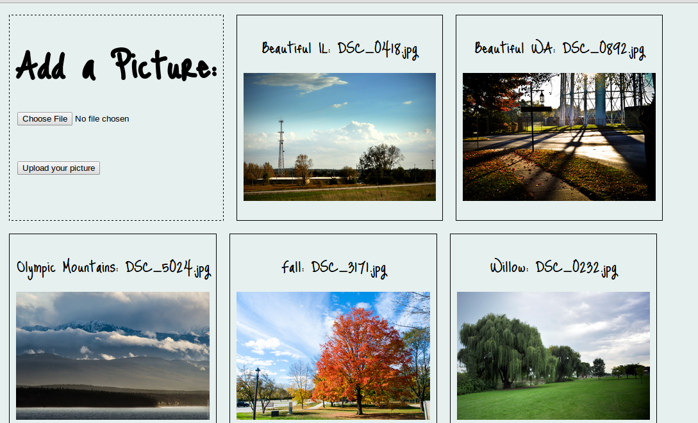

# Photo Shuffler
By [Ellen Musick](http://blog.ellenmusick.com/).

## Description
photo_shuffler allows you to share photos online.  The photos are saved to Amazon S3 using a background job. Here's a link to an example on Heroku: http://guarded-hollows-7793.herokuapp.com

## Installation

To get it running, you will need to have [Redis](http://redis.io/)) installed and also create .env file with the following keys:
```
AWS_ACCESS_KEY_ID:
AWS_SECRET_ACCESS_KEY:
AWS_S3_BUCKET:
```
You will also need to run the following commands:
```
bundle
rake db:setup
```
and finally, start up sidekiq (to manage background jobs) and the server:
```
bundle exec sidekiq
rails server
```

## Screenshot
Here's a screenshot of the app in action:


## Known Issues
If you discover any bugs, feel free to create an issue on GitHub fork and
send a pull request.

## License
http://evenellie.mit-license.org/
